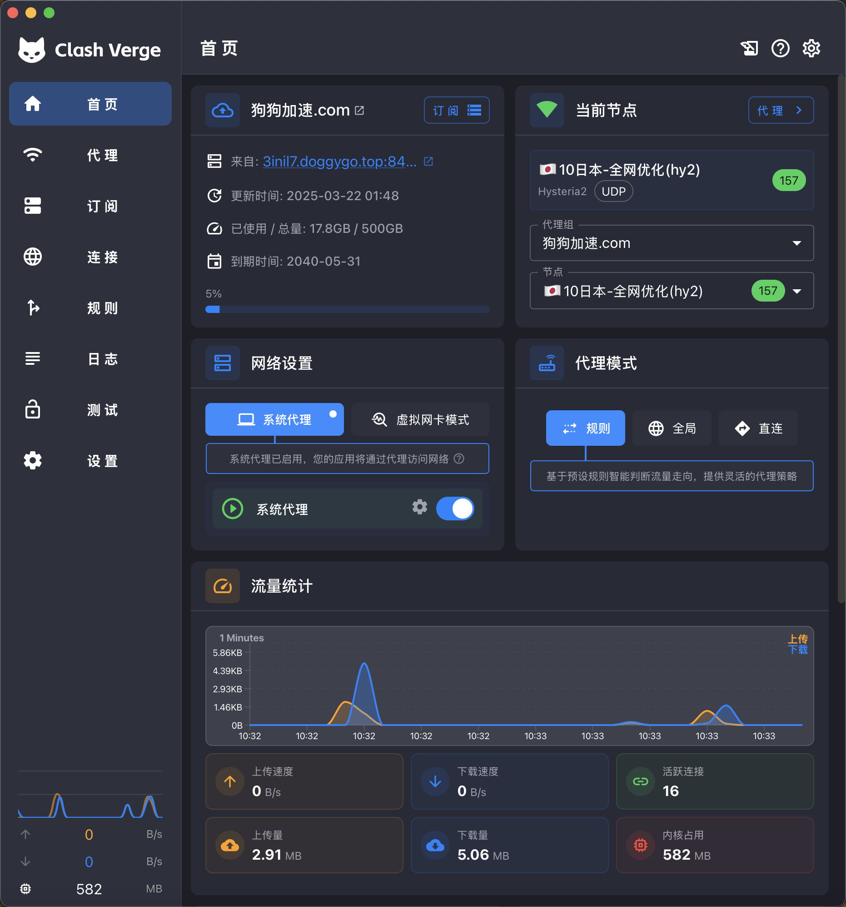

<h1 align="center">
  
  <br>
  Continuation of <a href="https://github.com/zzzgydi/clash-verge">Clash Verge</a>
  <br>
</h1>

<h3 align="center">
A Clash Meta GUI built with <a href="https://github.com/tauri-apps/tauri">Tauri</a>.
</h3>

<p align="center">
  Languages:
  <a href="../README.md">简体中文</a> ·
  <a href="./README_en.md">English</a> ·
  <a href="./README_es.md">Español</a> ·
  <a href="./README_ru.md">Русский</a> ·
  <a href="./README_ja.md">日本語</a> ·
  <a href="./README_ko.md">한국어</a> ·
  <a href="./README_fa.md">فارسی</a>
</p>

## Preview

| Dark                                | Light                                 |
| ----------------------------------- | ------------------------------------- |
|  |  |

## Install

Visit the [Release page](https://github.com/clash-verge-rev/clash-verge-rev/releases) to download the installer that matches your platform.<br>
We provide packages for Windows (x64/x86), Linux (x64/arm64), and macOS 10.15+ (Intel/Apple).

#### Choosing a Release Channel

| Channel     | Description                                                           | Link                                                                                   |
| :---------- | :-------------------------------------------------------------------- | :------------------------------------------------------------------------------------- |
| Stable      | Official builds with high reliability, ideal for daily use.           | [Release](https://github.com/clash-verge-rev/clash-verge-rev/releases)                 |
| Alpha (EOL) | Legacy builds used to validate the publish pipeline.                  | [Alpha](https://github.com/clash-verge-rev/clash-verge-rev/releases/tag/alpha)         |
| AutoBuild   | Rolling builds for testing and feedback. Expect experimental changes. | [AutoBuild](https://github.com/clash-verge-rev/clash-verge-rev/releases/tag/autobuild) |

#### Installation Guides & FAQ

Read the [project documentation](https://clash-verge-rev.github.io/) for install steps, troubleshooting, and frequently asked questions.

### Telegram Channel

Join [@clash_verge_rev](https://t.me/clash_verge_re) for update announcements.

---

## Promotion

### ✈️ [Doggygo VPN — A Technical-Grade Proxy Service](https://verge.dginv.click/#/register?code=oaxsAGo6)

🚀 A high-performance, overseas, technical-grade proxy service offering free trials and discounted plans, fully unlocking streaming platforms and AI services. The world’s first provider to adopt the **QUIC protocol**.

🎁 Register via the **Clash Verge exclusive invitation link** to receive **3 days of free trial**, with **1GB traffic per day**: 👉 [Register here](https://verge.dginv.click/#/register?code=oaxsAGo6)

#### **Core Advantages:**

- 📱 Self-developed iOS client (the industry’s “only one”), with technology proven in production and **significant ongoing R&D investment**
- 🧑‍💻 **12-hour live customer support** (also assists with Clash Verge usage issues)
- 💰 Discounted plans at **only CNY 21 per month, 160GB traffic, 20% off with annual billing**
- 🌍 Overseas team, no risk of shutdown or exit scams, with up to **50% referral commission**
- ⚙️ **Cluster-based load balancing** architecture with **real-time load monitoring and elastic scaling**, high-speed dedicated lines (compatible with legacy clients), ultra-low latency, unaffected by peak hours, **4K streaming loads instantly**
- ⚡ The world’s first **QUIC-protocol-based proxy service**, now featuring faster **QUIC-family protocols** (best paired with the Clash Verge client)
- 🎬 Unlocks **streaming platforms and mainstream AI services**

🌐 Official Website: 👉 [https://狗狗加速.com](https://verge.dginv.click/#/register?code=oaxsAGo6)

### 🤖 [GPTKefu — AI-Powered Customer Service Platform Deeply Integrated with Crisp](https://gptkefu.com)

- 🧠 Deep understanding of full conversation context + image recognition, automatically providing professional and precise replies — no more robotic responses.
- ♾️ **Unlimited replies**, no quota anxiety — unlike other AI customer service products that charge per message.
- 💬 Pre-sales inquiries, after-sales support, complex Q&A — covers all scenarios effortlessly, with real user cases to prove it.
- ⚡ 3-minute setup, zero learning curve — instantly boost customer service efficiency and satisfaction.
- 🎁 Free 14-day trial of the Premium plan — try before you pay: 👉 [Start Free Trial](https://gptkefu.com)
- 📢 AI Customer Service TG Channel: [@crisp_ai](https://t.me/crisp_ai)

---

## Features

- Built on high-performance Rust with the Tauri 2 framework
- Ships with the embedded [Clash.Meta (mihomo)](https://github.com/MetaCubeX/mihomo) core and supports switching to the `Alpha` channel
- Clean, polished UI with theme color controls, proxy group/tray icons, and `CSS Injection`
- Enhanced profile management (Merge and Script helpers) with configuration syntax hints
- System proxy controls, guard mode, and `TUN` (virtual network adapter) support
- Visual editors for nodes and rules
- WebDAV-based backup and sync for configurations

### FAQ

See the [FAQ page](https://clash-verge-rev.github.io/faq/windows.html) for platform-specific guidance.

### Donation

[Support Clash Verge Rev development](https://github.com/sponsors/clash-verge-rev)

## Development

See [CONTRIBUTING.md](../CONTRIBUTING.md) for detailed contribution guidelines.

After installing all **Tauri** prerequisites, run the development shell with:

```shell
pnpm i
pnpm run prebuild
pnpm dev
```

## Contributions

Issues and pull requests are welcome!

## Acknowledgement

Clash Verge Rev builds on or draws inspiration from these projects:

- [zzzgydi/clash-verge](https://github.com/zzzgydi/clash-verge): A Tauri-based Clash GUI for Windows, macOS, and Linux.
- [tauri-apps/tauri](https://github.com/tauri-apps/tauri): Build smaller, faster, more secure desktop apps with a web frontend.
- [Dreamacro/clash](https://github.com/Dreamacro/clash): A rule-based tunnel written in Go.
- [MetaCubeX/mihomo](https://github.com/MetaCubeX/mihomo): A rule-based tunnel written in Go.
- [Fndroid/clash_for_windows_pkg](https://github.com/Fndroid/clash_for_windows_pkg): A Clash GUI for Windows and macOS.
- [vitejs/vite](https://github.com/vitejs/vite): Next-generation frontend tooling with blazing-fast DX.

## License

GPL-3.0 License. See the [license file](../LICENSE) for details.
